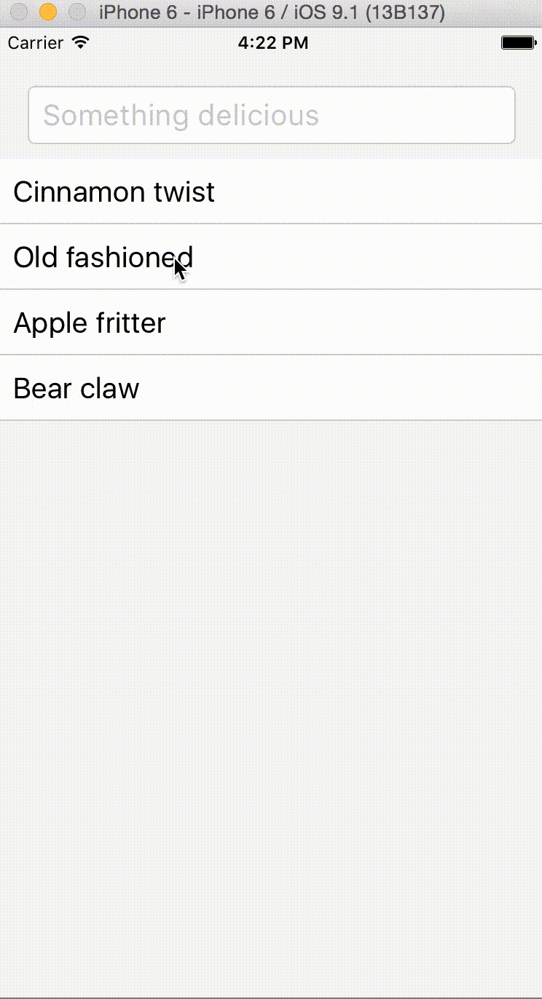

# Groceries

A simple grocery list app using React Native, Redux, Firebase, and Async Storage for offline data. It works on both iOS and Android.

[](https://codeclimate.com/github/bruz/react-native-redux-groceries)
[](https://david-dm.org/bruz/react-native-redux-groceries)
[](https://github.com/bruz/react-native-redux-groceries/blob/master/LICENSE)



## Install

Built and tested with:

* OSX
* Node 4.2.3 **with npm 3**
* Xcode 7
* Android SDK

A [Firebase](https://www.firebase.com) account is also needed.

Run:

```bash
git clone https://github.com/bruz/react-native-redux-groceries.git groceries
cd groceries
npm install
```

Configure:

```bash
cp config.js.example config.js
```

Edit config.js to have the URL of your Firebase app.

## Develop on iOS

```bash
open ios/Groceries.xcodeproj
```

This will launch Xcode. Just choose a device a press run.

## Develop on Android

* Follow the [React Native Android setup guide](https://facebook.github.io/react-native/docs/android-setup.html).
* Once you have a running emulator, run:

```bash
react-native run-android
```

## Build and install on an iOS device

* Run:

```bash
react-native bundle --dev false --entry-file index.ios.js --platform ios --minify --bundle-output ios/main.jsbundle
```

* In AppDelegate.m, comment out:

```bash
jsCodeLocation = [NSURL URLWithString:@"http://localhost:8081/index.ios.bundle"];
```

* Then uncomment this in AppDelegate.m:

```bash
//jsCodeLocation = [[NSBundle mainBundle] URLForResource:@"main" withExtension:@"jsbundle"];
```

* In the Xcode menu, go to Product -> Scheme -> Edit Scheme..., and under Run change the Build Configuration to Release.
* Choose your device in Xcode and run it on there.

To get back to development mode, just undo these changes.

## Build and install on an Android device

It hasn't been testing with this app, but the [React Native APK signing instructions](https://facebook.github.io/react-native/docs/signed-apk-android.html) may work.

## Credits

Grocery bag icon by [Claire Jones from the Noun Project](https://thenounproject.com/hivernoir)
